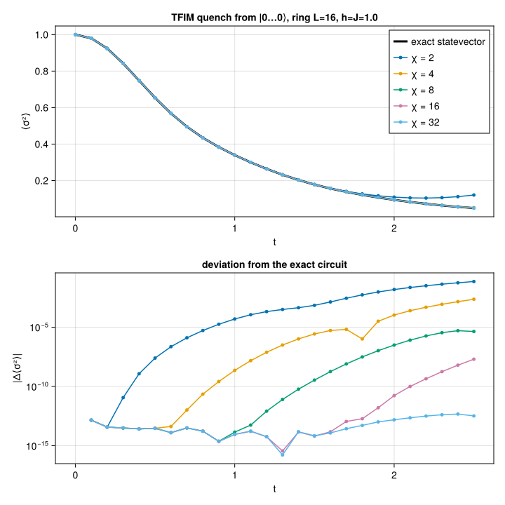

```@meta
EditURL = "../../../../examples/qasm_circuit/main.jl"
```


# Running OpenQASM circuits

Circuits are usually authored somewhere else — a Qiskit script, a benchmark suite like
QASMBench, a compiler pass — and exported as OpenQASM 2.0. Canopy reads such a file and runs
it as a tensor-network state, so nothing has to be transcribed into `LocalGate`s by hand.

Reading is a two-step affair:

1. `read_qasm` (from a path) or `parse_qasm` (from a string) returns a
   `QASMCircuit` — a physics-agnostic description in which qubits are plain 1-based
   integers and gates are symbolic names with evaluated numeric parameters. Register
   flattening, broadcast statements (`h q;`), classical expressions (`rz(pi/2)`) and
   user-declared `gate`s are all resolved here.
2. `Circuit(qc, state)` lowers that onto a [`TensorNetworkState`](@ref), producing a
   `Circuit` of `LocalGate`s that `apply!` accepts.

Keeping the two apart is what makes the qubit-to-lattice question a *lowering* concern rather
than a parsing one, and that is the interesting question here: a tensor-network state lives
on a graph, and a two-site gate can only act on an edge of that graph.

We do two things below. First a GHZ circuit read from a file, which is exact and pins down
the conventions. Then a 16-qubit Trotterized quench of the transverse-field Ising model,
where bond truncation actually bites, benchmarked against exact statevector evolution of the
very same circuit.

This example can be run from the command line with:

```
julia --project=examples examples/qasm_circuit/main.jl
```

````julia
using Canopy: read_qasm, parse_qasm, qasm_lattice, QASMCircuit, QASMStatement,
    product_state, vertices, virtualspace, UndirectedEdge,
    BPMessages, belief_propagation, Circuit, apply!, expect
using TensorKit
using TensorKitTensors.SpinOperators: σˣ, σᶻ
using MatrixAlgebraKit: truncrank
using Printf
using CairoMakie

const T = ComplexF64
const P = ComplexSpace(2)
const Z = σᶻ(T)
const X = σˣ(T)
````

````
2←2 TensorMap{ComplexF64, TensorKit.ComplexSpace, 1, 1, Vector{ComplexF64}}:
 codomain: ⊗(ℂ^2)
 domain: ⊗(ℂ^2)
 blocks: 
 * Trivial() => 2×2 reshape(view(::Vector{ComplexF64}, 1:4), 2, 2) with eltype ComplexF64:
 0.0+0.0im  1.0+0.0im
 1.0+0.0im  0.0+0.0im
````

## A GHZ circuit from a file

[`ghz.qasm`](ghz.qasm) is what a six-qubit GHZ preparation looks like coming out of Qiskit:
a `qreg`, an unused `creg`, a Hadamard, a `cx` ladder, and a trailing `barrier`.

````julia
print(read(joinpath(@__DIR__, "ghz.qasm"), String))
````

````
// GHZ state on six qubits, in the shape of a Qiskit `QuantumCircuit.qasm()` export.
// The trailing `measure meas -> q;` lines such an export ends with have been stripped:
// Canopy simulates the state, not the measurement record.
OPENQASM 2.0;
include "qelib1.inc";
qreg q[6];
creg meas[6];
h q[0];
cx q[0],q[1];
cx q[1],q[2];
cx q[2],q[3];
cx q[3],q[4];
cx q[4],q[5];
barrier q[0],q[1],q[2],q[3],q[4],q[5];

````

`read_qasm` reduces that to the gates it applies. The `include "qelib1.inc"` is accepted and
ignored (its gates are built in), the `creg` is recorded as declared and never used, and the
`barrier` is kept as a marker — hence seven statements for six primitive gates.

````julia
qc = read_qasm(joinpath(@__DIR__, "ghz.qasm"))
````

````
QASMCircuit(6 qubits: q[6])
  7 statements, 6 primitive gates
````

### Choosing the lattice

The state has to live on a graph whose edges cover every two-qubit gate in the circuit.
`qasm_lattice` reads that graph off the circuit itself, adding one edge per coupled
pair, so no gate ever needs routing. For a `cx` ladder this is just an open chain.

````julia
edges = qasm_lattice(qc)
````

````
5-element Vector{Canopy.UndirectedEdge{Int64}}:
 Canopy.UndirectedEdge{Int64}(1, 2)
 Canopy.UndirectedEdge{Int64}(2, 3)
 Canopy.UndirectedEdge{Int64}(3, 4)
 Canopy.UndirectedEdge{Int64}(4, 5)
 Canopy.UndirectedEdge{Int64}(5, 6)
````

The circuit's connectivity is used verbatim, which is both the convenience and the catch: a
densely connected circuit yields a densely connected network, on which belief propagation is
a poor approximation. Supplying your own lattice is the escape hatch, shown in the next
section.

### Lowering and applying

The initial state is the product state $|0\cdots0\rangle$; `Trivial() => [1.0, 0.0]` names
the local state as the coefficients of $|0\rangle$ in the (only) sector of a symmetry-free
physical space.

`Circuit(qc, state)` then maps qubit `i` onto vertex `i` — the default when the state has
`Int` vertices — and turns each statement into a gate tensor. Six primitive gates give six
gates here, but they would not in general: a statement supported on one or two qubits is
contracted into a *single* tensor, so a user-declared `gate` expanding to a dozen primitives
on two qubits still costs only one truncating update.

````julia
state = product_state(T, edges, P, Trivial() => [1.0, 0.0])
msgs = BPMessages(state)
circuit = Circuit(qc, state)

state, msgs, info = apply!(state, msgs, circuit; trunc = truncrank(4))
msgs = belief_propagation(msgs, state; maxiter = 200, tol = 1.0e-12)

@printf "%d statements → %d gates\n" length(qc) length(circuit.gatelist)
@printf "truncation error: %.3e\n" info.ϵ
@printf "bond dimensions:  %s\n" join(dim.(virtualspace.(Ref(state), edges)), ", ")
````

````
7 statements → 6 gates
truncation error: 0.000e+00
bond dimensions:  2, 2, 2, 2, 2

````

A GHZ state has bond dimension 2 everywhere, so nothing was truncated even though four was
allowed. Its signature is that every spin is unpolarized while every pair is perfectly
correlated: $\langle \sigma^z_i \rangle = \langle \sigma^x_i \rangle = 0$ and
$\langle \sigma^z_i \sigma^z_j \rangle = 1$. `expect` takes a single vertex for a one-site
operator and an `UndirectedEdge` (or a pair of vertices) for a two-site one.

````julia
@printf "⟨σᶻ⟩   = %s\n" join((@sprintf("%+.3f", real(expect(state, msgs, Z, v))) for v in 1:6), "  ")
@printf "⟨σˣ⟩   = %s\n" join((@sprintf("%+.3f", real(expect(state, msgs, X, v))) for v in 1:6), "  ")
@printf "⟨σᶻσᶻ⟩ = %s\n" join((@sprintf("%+.3f", real(expect(state, msgs, Z ⊗ Z, e))) for e in edges), "  ")
````

````
⟨σᶻ⟩   = +0.000  +0.000  +0.000  +0.000  +0.000  +0.000
⟨σˣ⟩   = +0.000  +0.000  +0.000  +0.000  +0.000  +0.000
⟨σᶻσᶻ⟩ = +1.000  +1.000  +1.000  +1.000  +1.000

````

## Putting the qubits somewhere else

When the circuit's own connectivity is not the lattice you want, pass both a lattice and a
`qubitmap` saying which vertex each qubit occupies. Every two-qubit gate still has to land on
an edge, but which edge is now up to you — and the lattice may carry edges the circuit never
uses.

Here the same GHZ ladder goes onto a six-site *ring*, reversed, so that qubit `i` sits at
vertex `7 - i`. The ladder occupies five of the ring's six edges and the closing edge
`(6, 1)` stays idle.

````julia
ring = [UndirectedEdge(i, mod1(i + 1, 6)) for i in 1:6]
ring_state = product_state(T, ring, P, Trivial() => [1.0, 0.0])
ring_msgs = BPMessages(ring_state)

ring_circuit = Circuit(qc, ring_state; qubitmap = 6:-1:1, layered = true)
ring_state, ring_msgs, _ = apply!(ring_state, ring_msgs, ring_circuit; trunc = truncrank(4))
ring_msgs = belief_propagation(ring_msgs, ring_state; maxiter = 200, tol = 1.0e-12)

@printf "⟨σᶻσᶻ⟩ = %s\n" join(
    (@sprintf("%+.3f", real(expect(ring_state, ring_msgs, Z ⊗ Z, e))) for e in ring), "  "
)
````

````
⟨σᶻσᶻ⟩ = +1.000  +1.000  +1.000  +1.000  +1.000  +0.000

````

The five ladder edges come out perfectly correlated as before, and the idle sixth edge comes
out at zero — which is a useful thing to have seen, because the exact answer is 1: that edge
joins qubits 6 and 1, and GHZ correlates *every* pair.

The reason is that `expect` on two sites is a Bethe estimate, not an exact contraction. It
closes the environment with belief-propagation messages and contracts the two site tensors
through the bond between them, and no gate ever raised that bond above dimension 1. A
dimension-1 bond cannot carry correlation, so the estimate factorizes into two maximally
mixed marginals. Correlations reach an observable only along bonds the circuit has actually
used — worth remembering when choosing a lattice larger than the circuit needs.

## What is rejected

Canopy has no measurement, collapse or classical-register machinery, so `measure`, `reset`,
`if` and `opaque` are errors rather than silent no-ops — strip them and simulate the state
they act on. And since `apply!` implements one- and two-site gates only, a genuine
three-qubit gate has to be decomposed upstream (Qiskit's transpiler will do it).

````julia
for src in (
        "OPENQASM 2.0;\nqreg q[1];\ncreg c[1];\nmeasure q[0] -> c[0];\n",
        "OPENQASM 2.0;\nqreg q[3];\nccx q[0], q[1], q[2];\n",
    )
    try
        qasm_lattice(parse_qasm(src))
    catch err
        println(err.msg)
    end
end
````

````
`measure` is not supported: Canopy has no measurement or classical-register machinery
`ccx` acts on 3 qubits, but `apply!` implements only one- and two-site gates; decompose it into one- and two-qubit gates first

````

## A quench of the transverse-field Ising model

Now a circuit where the tensor network is doing real work. We quench

```math
H = -J \sum_{\langle ij \rangle} \sigma^z_i \sigma^z_j - h \sum_i \sigma^x_i
```

on a ring of $L = 16$ qubits at the critical point $h = J = 1$, starting from the fully
polarized $|0\cdots0\rangle$, and follow the order parameter
$\langle \sigma^z \rangle(t) = L^{-1} \sum_i \langle \sigma^z_i \rangle$.

The circuit is a first-order Trotter splitting of $e^{-iHt}$: per step, the
$\sigma^z\sigma^z$ bonds in two non-overlapping (even/odd) layers, then a transverse-field
layer. In OpenQASM that is `rzz(-2 J dt)` and `rx(-2 h dt)`, since
`rzz(θ) = exp(-i θ σᶻσᶻ / 2)` and `rx(θ) = exp(-i θ σˣ / 2)`.

We emit it as OpenQASM text rather than as Julia gates, which is the whole point of the
example — and it lets the source exercise a few conveniences of the language: the bond gate
is a user-declared `gate` whose body evaluates a classical expression, the field layer is a
single statement broadcast over the whole register, and each step ends with a `barrier`.

````julia
const L = 16
const J = 1.0
const h = 1.0
const DT = 0.1
const NSTEPS = 25
const CHIS = (2, 4, 8, 16, 32)

function tfim_qasm(L, J, h, dt, nsteps)
    io = IOBuffer()
    println(io, "OPENQASM 2.0;")
    println(io, "include \"qelib1.inc\";")
    println(io, "gate ising(dt) a, b { rzz(-2*dt) a, b; }")
    println(io, "qreg q[$L];")
    for _ in 1:nsteps
        # even bonds, then odd bonds: two layers of mutually non-overlapping gates
        for parity in (0, 1), i in parity:2:(L - 1)
            println(io, "ising($(J * dt)) q[$i], q[$(mod(i + 1, L))];")
        end
        println(io, "rx(-2*$(h * dt)) q;")
        println(io, "barrier q;")
    end
    return String(take!(io))
end

qasm_source = tfim_qasm(L, J, h, DT, NSTEPS)
println(join(split(qasm_source, '\n')[1:14], '\n'), "\n...")
````

````
OPENQASM 2.0;
include "qelib1.inc";
gate ising(dt) a, b { rzz(-2*dt) a, b; }
qreg q[16];
ising(0.1) q[0], q[1];
ising(0.1) q[2], q[3];
ising(0.1) q[4], q[5];
ising(0.1) q[6], q[7];
ising(0.1) q[8], q[9];
ising(0.1) q[10], q[11];
ising(0.1) q[12], q[13];
ising(0.1) q[14], q[15];
ising(0.1) q[1], q[2];
ising(0.1) q[3], q[4];
...

````

### Splitting the circuit at its barriers

`parse_qasm` gives one `QASMCircuit` for the whole evolution, but we want an observable after
every Trotter step. The IR is an ordinary struct holding statements in source order, so it
can be cut into per-step circuits at the `barrier` markers.

````julia
qc_tfim = parse_qasm(qasm_source)

function split_at_barriers(qc::QASMCircuit)
    steps = QASMCircuit[]
    chunk = QASMStatement[]
    for stmt in qc.statements
        if stmt.barrier
            isempty(chunk) || push!(steps, QASMCircuit(qc.nqubits, qc.registers, chunk))
            chunk = QASMStatement[]
        else
            push!(chunk, stmt)
        end
    end
    isempty(chunk) || push!(steps, QASMCircuit(qc.nqubits, qc.registers, chunk))
    return steps
end

steps = split_at_barriers(qc_tfim)
@printf "%d Trotter steps of %d statements each\n" length(steps) length(first(steps))
````

````
25 Trotter steps of 32 statements each

````

`qasm_lattice` recovers the ring, including the bond that closes it. That loop is why belief
propagation is genuinely an approximation here, and not merely a bookkeeping device as it was
on the GHZ chain.

````julia
tfim_edges = qasm_lattice(qc_tfim)
````

````
16-element Vector{Canopy.UndirectedEdge{Int64}}:
 Canopy.UndirectedEdge{Int64}(1, 2)
 Canopy.UndirectedEdge{Int64}(3, 4)
 Canopy.UndirectedEdge{Int64}(5, 6)
 Canopy.UndirectedEdge{Int64}(7, 8)
 Canopy.UndirectedEdge{Int64}(9, 10)
 Canopy.UndirectedEdge{Int64}(11, 12)
 Canopy.UndirectedEdge{Int64}(13, 14)
 Canopy.UndirectedEdge{Int64}(15, 16)
 Canopy.UndirectedEdge{Int64}(2, 3)
 Canopy.UndirectedEdge{Int64}(4, 5)
 Canopy.UndirectedEdge{Int64}(6, 7)
 Canopy.UndirectedEdge{Int64}(8, 9)
 Canopy.UndirectedEdge{Int64}(10, 11)
 Canopy.UndirectedEdge{Int64}(12, 13)
 Canopy.UndirectedEdge{Int64}(14, 15)
 Canopy.UndirectedEdge{Int64}(1, 16)
````

### Exact reference

At $L = 16$ the full $2^{16}$ statevector is cheap, so we can evolve it exactly and thereby
isolate the *truncation* error: the reference applies the identical lowered gates, so the
first-order Trotter error is common to both runs and cancels out of the comparison.

Those gates come straight off the lowered `Circuit`, whose `LocalGate`s carry their `sites`
and their `tensor`. Dense leg `i` belongs to the `i`-th vertex of `vertices(state)`; that
iteration order is insertion order rather than sorted order, so it is read off the state
instead of assumed.

````julia
function dense_apply(ψ::Array{T}, circuit, pos)
    n = ndims(ψ)
    for g in circuit.gatelist
        k = length(g.sites)
        u = reshape(convert(Array, g.tensor), 2^k, 2^k)
        legs = [pos[s] for s in g.sites]
        # bring the target legs to the front, hit them with the gate matrix, put them back
        perm = vcat(legs, setdiff(1:n, legs))
        φ = u * reshape(permutedims(ψ, perm), 2^k, :)
        ψ = permutedims(reshape(φ, ntuple(_ -> 2, n)), invperm(perm))
    end
    return ψ
end

# L⁻¹ Σᵢ ⟨σᶻᵢ⟩ of a (not necessarily normalized) dense statevector
function dense_mz(ψ::Array{T})
    n = ndims(ψ)
    return sum(1:n) do d
        A = reshape(ψ, 2^(d - 1), 2, :)
        return sum(abs2, view(A, :, 1, :)) - sum(abs2, view(A, :, 2, :))
    end / (n * sum(abs2, ψ))
end

function run_exact(steps, edges)
    state = product_state(T, edges, P, Trivial() => [1.0, 0.0])
    pos = Dict(v => i for (i, v) in enumerate(vertices(state)))
    n = length(pos)
    ψ = zeros(T, ntuple(_ -> 2, n))
    ψ[ntuple(_ -> 1, n)...] = 1
    mz = [dense_mz(ψ)]
    for s in steps
        ψ = dense_apply(ψ, Circuit(s, state), pos)
        push!(mz, dense_mz(ψ))
    end
    return mz
end
````

````
run_exact (generic function with 1 method)
````

### The tensor-network run

One `apply!` per Trotter step, re-converging the belief-propagation messages afterwards so
that the next step's truncations are taken in a well-gauged basis, and measuring in between.
`truncrank(χ)` caps every bond at `χ`.

This is also where `layered = true` earns its keep: within a step the even bonds, the odd
bonds and the field layer are each sets of mutually non-overlapping gates, and the `barrier`
prevents a layer from straddling two steps.

````julia
function run_bp(steps, edges, χ)
    state = product_state(T, edges, P, Trivial() => [1.0, 0.0])
    msgs = BPMessages(state)
    circuits = [Circuit(s, state; layered = true) for s in steps]

    mz = [sum(real(expect(state, msgs, Z, v)) for v in 1:L) / L]
    ϵmax = 0.0
    for circuit in circuits
        state, msgs, info = apply!(state, msgs, circuit; trunc = truncrank(χ))
        msgs = belief_propagation(msgs, state; maxiter = 200, tol = 1.0e-10)
        ϵmax = max(ϵmax, info.ϵ)
        push!(mz, sum(real(expect(state, msgs, Z, v)) for v in 1:L) / L)
    end
    return mz, ϵmax
end
````

````
run_bp (generic function with 1 method)
````

### Sweep and compare

````julia
ts = DT .* (0:NSTEPS)

println("TFIM quench  L=$L  J=$J  h=$h  dt=$DT  steps=$NSTEPS")
mz_exact = run_exact(steps, tfim_edges)

mz_bp = Dict{Int, Vector{Float64}}()
@printf "  %-5s  %-13s  %-13s  %-10s\n" "χ" "⟨σᶻ⟩(t=2.5)" "max |Δ⟨σᶻ⟩|" "max ϵ"
for χ in CHIS
    mz, ϵmax = run_bp(steps, tfim_edges, χ)
    mz_bp[χ] = mz
    @printf "  %-5d  %-13.9f  %-13.3e  %-10.2e\n" χ mz[end] maximum(abs, mz - mz_exact) ϵmax
    flush(stdout)
end
@printf "  %-5s  %-13.9f\n" "exact" mz_exact[end]
````

````
TFIM quench  L=16  J=1.0  h=1.0  dt=0.1  steps=25
  χ      ⟨σᶻ⟩(t=2.5)    max |Δ⟨σᶻ⟩|    max ϵ     
  2      0.120858206    7.142e-02      8.14e-02  
  4      0.051713053    2.274e-03      5.86e-02  
  8      0.049434482    5.080e-06      7.90e-03  
  16     0.049438800    1.991e-08      1.04e-04  
  32     0.049438820    4.710e-13      3.72e-07  
  exact  0.049438820  

````

The order parameter decays from 1 towards 0, and the tensor-network curves converge onto the
exact one exponentially in $\chi$: at $\chi = 4$ the worst-case deviation over the whole
trajectory is already $\sim 2 \times 10^{-3}$, and by $\chi = 32$ the circuit is reproduced
to below $10^{-12}$.

That last number also says something about the loop: since raising $\chi$ alone drives the
error to $10^{-13}$, the Bethe approximation on this ring costs at most that much for these
observables. Bond truncation, not belief propagation, is the accuracy bottleneck here.

`max ϵ` is the largest discarded weight over all steps and bonds. It runs one to two orders
of magnitude above the error in $\langle \sigma^z \rangle$ — local observables are far less
sensitive than the full wavefunction — but it falls with $\chi$ in step with it, which makes
it the quantity to watch when no exact reference is at hand.

````julia
let
    fig = Figure(size = (720, 720))
    colors = Makie.wong_colors()

    ax1 = Axis(
        fig[1, 1]; xlabel = "t", ylabel = "⟨σᶻ⟩",
        title = "TFIM quench from |0…0⟩, ring L=$L, h=J=$J"
    )
    lines!(ax1, ts, mz_exact; color = :black, linewidth = 3, label = "exact statevector")
    for (i, χ) in enumerate(CHIS)
        scatterlines!(ax1, ts, mz_bp[χ]; color = colors[i], markersize = 7, label = "χ = $χ")
    end
    axislegend(ax1; position = :rt)

    # same colours as above, so this panel needs no legend of its own
    ax2 = Axis(
        fig[2, 1]; xlabel = "t", ylabel = "|Δ⟨σᶻ⟩|", yscale = log10,
        title = "deviation from the exact circuit"
    )
    for (i, χ) in enumerate(CHIS)
        # t = 0 is exact by construction and would fall off a log axis
        err = max.(abs.(mz_bp[χ] - mz_exact)[2:end], 1.0e-16)
        scatterlines!(ax2, ts[2:end], err; color = colors[i], markersize = 7)
    end
    linkxaxes!(ax1, ax2)

    outdir = joinpath(@__DIR__, "figs"); mkpath(outdir)
    outfile = joinpath(outdir, "qasm_circuit.svg")
    save(outfile, fig)
    println("wrote $outfile")
    fig
end
````

````
wrote /mnt/home/ldevos/Projects/Canopy/QASM/docs/src/examples/qasm_circuit/figs/qasm_circuit.svg

````



---

*This page was generated using [Literate.jl](https://github.com/fredrikekre/Literate.jl).*

