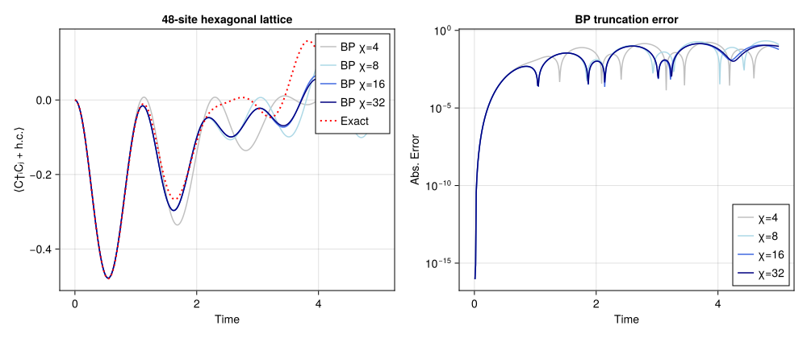

```@meta
EditURL = "../../../../examples/realtime/main.jl"
```


# Real-time evolution of free fermions

Real-time evolution of spinless free fermions on a finite honeycomb lattice,

```math
H = -\sum_{\langle ij \rangle} \left( c^\dagger_i c_j + \text{h.c.} \right) + \mu \sum_i (\pm 1)_i\, n_i,
\qquad |\psi_t\rangle = e^{-iHt} |\psi_0\rangle.
```

A quench from a product state in a staggered (sublattice-alternating) field, evolved in real
time by belief propagation + bond truncation, benchmarked against the exact single-particle
solution. This reproduces panel (b) of `FreeFermionBenchmark.pdf` (48-site hexagonal
lattice): the central-bond hopping $\langle C^\dagger_i C_j + \text{h.c.} \rangle$ vs. time
for BP bond dimensions $\chi \in \{4, 8, 16, 32\}$, overlaid on the truncation-free reference.

This is a Canopy port of `examples/realtime/example.jl` (which uses
TensorNetworkQuantumSimulator + NamedGraphs). Two representation notes:

- NamedGraphs labels honeycomb vertices `(i, j)` and the bipartite sublattice is
  `isodd(i+j)`; Canopy's `hexagonal_lattice` labels them `(i, j, s)` with the sublattice
  carried explicitly by `s ∈ {1, 2}`. The staggered field is therefore set per sublattice
  `s` here — the physical image of `example.jl`'s `isodd(sum(v))` field.
- The initial-occupation rule `sum(v) % 4 == 0 ? empty : occupied` is ported literally; on
  48 sites it leaves 36 occupied (¾-filled, even parity — the PDF's "quarter filling" counts
  the ¼ holes). Flip to `... ? occupied : empty` for literal ¼ occupation.

Real time uses the same first-order split as `example.jl`: each `dt` step applies the on-site
number layer, the hopping layer, then the on-site layer again. The exact reference applies the
identical circuit to the single-particle correlation matrix, so it differs from the TN run
only by bond truncation.

This example can be run from the command line with:

```
julia --project=examples examples/realtime/main.jl
```

````julia
using Canopy: hexagonal_lattice, product_state, BPMessages, belief_propagation,
    UndirectedEdge, LocalGate, CompositeGate, Circuit, apply!, edge_coloring,
    expect, virtualspace
using TensorKit
using TensorKitTensors.FermionOperators: f_num, f_hopping, fermion_space
using MatrixAlgebraKit: truncrank
using Dictionaries
using LinearAlgebra: Diagonal, transpose
using Printf
using TimerOutputs
using CairoMakie
````

## Model and run parameters

The defaults reproduce the full `FreeFermionBenchmark.pdf` panel (b) x-axis, evolving to
`T_FINAL = 5.0` (cost ≈ `length(CHIS) · NSTEPS · BP`). For a quicker preview that still shows
BP tracking the exact curve through the first oscillations, lower `T_FINAL` (e.g. `1.5`).

````julia
const M, N = 4, 6              # m × n unit cells → 2·m·n = 48 sites
const T_HOP = -1.0             # hopping coefficient t  (H = -Σ c†c + h.c. + …)
const MU = 1.0                # staggered-field amplitude
const DT = 0.01
const T_FINAL = 5.0
const NSTEPS = round(Int, T_FINAL / DT)
const CHIS = (4, 8, 16, 32)
const BP_ITERS = 30           # per-step BP sweeps (warm-started from the previous step)

const ES = hexagonal_lattice(M, N)                       # open-boundary honeycomb
const VERTS = sort(unique(Iterators.flatten((e.src, e.dst) for e in ES)))
const HOPOP = f_hopping(ComplexF64, Trivial)             # c†_i c_j + c†_j c_i
````

````
2×2←2×2 TensorMap{ComplexF64, Vect[FermionParity], 2, 2, Vector{ComplexF64}}:
 codomain: (Vect[FermionParity](0 => 1, 1 => 1) ⊗ Vect[FermionParity](0 => 1, 1 => 1))
 domain: (Vect[FermionParity](0 => 1, 1 => 1) ⊗ Vect[FermionParity](0 => 1, 1 => 1))
 blocks: 
 * FermionParity(0) => 2×2 reshape(view(::Vector{ComplexF64}, 1:4), 2, 2) with eltype ComplexF64:
 0.0+0.0im  0.0+0.0im
 0.0+0.0im  0.0+0.0im

 * FermionParity(1) => 2×2 reshape(view(::Vector{ComplexF64}, 5:8), 2, 2) with eltype ComplexF64:
 0.0+0.0im  1.0+0.0im
 1.0+0.0im  0.0+0.0im
````

The staggered $\pm\mu$ field alternates on the two sublattices ($s = 1 \to +\mu$,
$s = 2 \to -\mu$), and the initial occupation is empty iff `sum(v) % 4 == 0` (the
`example.jl` rule):

````julia
μ_of(v) = isodd(v[3]) ? MU : -MU
occ_of(v) = (sum(v) % 4 == 0) ? 0 : 1
````

````
occ_of (generic function with 1 method)
````

We measure on the occupied/empty-straddling edge nearest the lattice centre. Coherence
$\langle C^\dagger C \rangle$ only builds on a bond whose two sites start with *different*
occupation, so a bond inside a uniformly-filled region would stay $\approx 0$.

````julia
const _CENTER = ((M + 1) / 2, (N + 1) / 2)
const BOND = argmin(
    e -> sum(abs2, ((e.src[1], e.src[2]) .+ (e.dst[1], e.dst[2])) ./ 2 .- _CENTER),
    filter(e -> occ_of(e.src) != occ_of(e.dst), ES),
)
const VC, VN = BOND.src, BOND.dst
````

````
((2, 3, 1), (3, 3, 2))
````

## Initial product state

````julia
function initial_state()
    P = fermion_space(Trivial)
    ps = Dictionary(VERTS, fill(P, length(VERTS)))
    ls = Dictionary(VERTS, [fℤ₂(occ_of(v)) => [1.0] for v in VERTS])
    return product_state(ComplexF64, ES, ps, ls)
end
````

````
initial_state (generic function with 1 method)
````

## Trotter layers

One `dt` step is single-site, hopping, single-site.

````julia
function build_layers()
    n = f_num(ComplexF64, Trivial)
    g_plus = exp(-im * MU * DT * n)
    g_minus = exp(-im * (-MU) * DT * n)
    g_hop = exp(-im * (T_HOP * DT) * HOPOP)
    single = CompositeGate([LocalGate((v,), μ_of(v) > 0 ? g_plus : g_minus) for v in VERTS])
    hop = Circuit([
        CompositeGate([LocalGate((e.src, e.dst), g_hop) for e in class])
        for class in edge_coloring(ES)
    ])
    return single, hop
end
````

````
build_layers (generic function with 1 method)
````

## Single-χ real-time trajectory

````julia
function run_chi(χ; verbose=true)
    state = initial_state()
    msgs = BPMessages(state)
    msgs = belief_propagation(msgs, state; maxiter=BP_ITERS)
    single, hop = build_layers()
    trunc = truncrank(χ)
    to = TimerOutput()

    traj = zeros(Float64, NSTEPS + 1)
    traj[1] = real(expect(state, msgs, HOPOP, BOND))
    t_gate = 0.0
    t_bp = 0.0
    for step in 1:NSTEPS
        t1 = time()
        # `apply!` parallelizes its gates with `Threads.@threads`, so we time it from this
        # (sequential) level rather than threading a shared `TimerOutput` into the gate loop.
        state, msgs, _ = @timeit to "single" apply!(state, msgs, single)
        state, msgs, _ = @timeit to "hop" apply!(state, msgs, hop; trunc)
        state, msgs, _ = @timeit to "single" apply!(state, msgs, single)
        t2 = time()
        # each dt step perturbs the state only slightly, so BP reconverges quickly
        # from the previous messages — the tol lets it stop early.
        msgs = @timeit to "bp" belief_propagation(msgs, state; maxiter=BP_ITERS, tol=1e-10)
        t3 = time()
        t_gate += t2 - t1
        t_bp += t3 - t2
        traj[step+1] = real(expect(state, msgs, HOPOP, BOND))
        if verbose && step % 25 == 0
            bd = maximum(dim(virtualspace(state, e)) for e in ES)
            @printf("χ=%2d  t=%.2f  meas=% .5f  step=%.3fs (gate %.3f / bp %.3f)  D=%d\n",
                χ, step * DT, traj[step+1], t3 - t1, t2 - t1, t3 - t2, bd)
            flush(stdout)
        end
    end
    verbose && @printf("χ=%2d done — gate %.2fs, bp %.2fs total\n", χ, t_gate, t_bp)
    return traj, to
end
````

````
run_chi (generic function with 1 method)
````

## Exact single-particle reference

The truncation-free reference uses the same circuit:
$C[i,j] = \langle c^\dagger_i c_j \rangle$ evolves as
$C \to \overline{u}\, C\, u^{\mathsf{T}}$ under each gate's single-particle unitary $u$,
applied in the same order as the TN circuit.

````julia
apply_one_mode!(C, a, ph) = (@views(C[a, :] .*= conj(ph)); @views(C[:, a] .*= ph); C)
function apply_two_mode!(C, a, b, w)
    blk = [a, b]
    @views C[blk, :] .= conj(w) * C[blk, :]
    @views C[:, blk] .= C[:, blk] * transpose(w)
    return C
end

function exact_traj()
    idx = Dict(v => k for (k, v) in enumerate(VERTS))
    occ = Float64[occ_of(v) for v in VERTS]
    w = exp(-im * (T_HOP * DT) * ComplexF64[0 1; 1 0])
    ph = Dict(v => exp(-im * μ_of(v) * DT) for v in VERTS)
    hop_order = collect(Iterators.flatten(edge_coloring(ES)))
    i1, i2 = idx[VC], idx[VN]
    obs(C) = real(C[i1, i2] + C[i2, i1])

    traj = zeros(Float64, NSTEPS + 1)
    C = complex(Matrix(Diagonal(occ)))
    traj[1] = obs(C)
    for step in 1:NSTEPS
        for v in VERTS
            apply_one_mode!(C, idx[v], ph[v])
        end
        for e in hop_order
            apply_two_mode!(C, idx[e.src], idx[e.dst], w)
        end
        for v in VERTS
            apply_one_mode!(C, idx[v], ph[v])
        end
        traj[step+1] = obs(C)
    end
    return traj
end
````

````
exact_traj (generic function with 1 method)
````

## Run sweep and plot

Run the exact reference and the BP trajectory at each $\chi$, then plot the central-bond
hopping vs. time alongside the absolute error from the exact curve.

````julia
function main()
    println("Real-time free-fermion quench on a $(2 * M * N)-site hexagonal lattice (Canopy.jl)")
    println("dt=$DT  steps=$NSTEPS  (t_final=$T_FINAL)  χ=$(CHIS)  bond=$(VC)–$(VN)")
    println("filling = $(sum(occ_of, VERTS))/$(length(VERTS)) occupied\n")

    times = collect(0:NSTEPS) .* DT
    ex = exact_traj()
    trajs = Dict{Int,Vector{Float64}}()
    tos = Dict{Int,TimerOutput}()
    for χ in CHIS
        trajs[χ], tos[χ] = run_chi(χ)
    end

    println("\nTimerOutputs breakdown (χ=$(last(CHIS))):")
    show(tos[last(CHIS)]; allocations=false, compact=true, sortby=:firstexec)
    println()

    colors = [:silver, :lightblue, :royalblue, :navy]
    fig = Figure(size=(1000, 420))
    ax1 = Axis(fig[1, 1]; xlabel="Time", ylabel="⟨C†ᵢCⱼ + h.c.⟩",
        title="$(2 * M * N)-site hexagonal lattice")
    for (k, χ) in enumerate(CHIS)
        lines!(ax1, times, trajs[χ]; label="BP χ=$χ", color=colors[mod1(k, length(colors))])
    end
    lines!(ax1, times, ex; label="Exact", color=:red, linestyle=:dot, linewidth=2)
    axislegend(ax1; position=:rt)

    ax2 = Axis(fig[1, 2]; xlabel="Time", ylabel="Abs. Error", yscale=log10,
        title="BP truncation error")
    for (k, χ) in enumerate(CHIS)
        err = max.(abs.(trajs[χ] .- ex), 1e-16)   # floor for log scale
        lines!(ax2, times, err; label="χ=$χ", color=colors[mod1(k, length(colors))])
    end
    axislegend(ax2; position=:rb)

    outdir = joinpath(@__DIR__, "figs")
    mkpath(outdir)
    outfile = joinpath(outdir, "realtime_hexagonal.svg")
    save(outfile, fig)
    println("wrote $outfile")
    return fig
end

main()
````

````
Real-time free-fermion quench on a 48-site hexagonal lattice (Canopy.jl)
dt=0.01  steps=500  (t_final=5.0)  χ=(4, 8, 16, 32)  bond=(2, 3, 1)–(3, 3, 2)
filling = 36/48 occupied

χ= 4  t=0.25  meas=-0.20909  step=0.061s (gate 0.029 / bp 0.032)  D=4
χ= 4  t=0.50  meas=-0.46999  step=0.083s (gate 0.031 / bp 0.052)  D=4
χ= 4  t=0.75  meas=-0.33713  step=0.107s (gate 0.031 / bp 0.076)  D=4
χ= 4  t=1.00  meas=-0.04522  step=0.168s (gate 0.031 / bp 0.137)  D=4
χ= 4  t=1.25  meas=-0.03061  step=0.170s (gate 0.030 / bp 0.140)  D=4
χ= 4  t=1.50  meas=-0.25369  step=0.141s (gate 0.032 / bp 0.109)  D=4
χ= 4  t=1.75  meas=-0.32351  step=0.165s (gate 0.029 / bp 0.135)  D=4
χ= 4  t=2.00  meas=-0.14215  step=0.151s (gate 0.024 / bp 0.127)  D=4
χ= 4  t=2.25  meas= 0.00314  step=0.179s (gate 0.034 / bp 0.145)  D=4
χ= 4  t=2.50  meas=-0.04556  step=0.230s (gate 0.063 / bp 0.167)  D=4
χ= 4  t=2.75  meas=-0.13201  step=0.235s (gate 0.037 / bp 0.198)  D=4
χ= 4  t=3.00  meas=-0.09819  step=0.237s (gate 0.034 / bp 0.203)  D=4
χ= 4  t=3.25  meas=-0.01264  step=0.264s (gate 0.031 / bp 0.234)  D=4
χ= 4  t=3.50  meas= 0.00952  step=0.296s (gate 0.036 / bp 0.259)  D=4
χ= 4  t=3.75  meas=-0.01103  step=0.277s (gate 0.030 / bp 0.246)  D=4
χ= 4  t=4.00  meas= 0.00139  step=0.277s (gate 0.032 / bp 0.245)  D=4
χ= 4  t=4.25  meas= 0.04083  step=0.285s (gate 0.032 / bp 0.253)  D=4
χ= 4  t=4.50  meas= 0.05384  step=0.278s (gate 0.060 / bp 0.218)  D=4
χ= 4  t=4.75  meas= 0.03570  step=0.279s (gate 0.031 / bp 0.248)  D=4
χ= 4  t=5.00  meas= 0.02263  step=0.283s (gate 0.036 / bp 0.247)  D=4
χ= 4 done — gate 32.02s, bp 85.10s total
χ= 8  t=0.25  meas=-0.20909  step=0.087s (gate 0.067 / bp 0.020)  D=8
χ= 8  t=0.50  meas=-0.47002  step=0.071s (gate 0.037 / bp 0.034)  D=8
χ= 8  t=0.75  meas=-0.33799  step=0.137s (gate 0.041 / bp 0.095)  D=8
χ= 8  t=1.00  meas=-0.05482  step=0.154s (gate 0.041 / bp 0.113)  D=8
χ= 8  t=1.25  meas=-0.06801  step=0.127s (gate 0.041 / bp 0.087)  D=8
χ= 8  t=1.50  meas=-0.26204  step=0.180s (gate 0.038 / bp 0.142)  D=8
χ= 8  t=1.75  meas=-0.25985  step=0.183s (gate 0.064 / bp 0.119)  D=8
χ= 8  t=2.00  meas=-0.09849  step=0.201s (gate 0.041 / bp 0.160)  D=8
χ= 8  t=2.25  meas=-0.05302  step=0.243s (gate 0.076 / bp 0.167)  D=8
χ= 8  t=2.50  meas=-0.10394  step=0.264s (gate 0.071 / bp 0.193)  D=8
χ= 8  t=2.75  meas=-0.06890  step=0.247s (gate 0.040 / bp 0.206)  D=8
χ= 8  t=3.00  meas= 0.00403  step=0.269s (gate 0.041 / bp 0.228)  D=8
χ= 8  t=3.25  meas=-0.03427  step=0.319s (gate 0.067 / bp 0.252)  D=8
χ= 8  t=3.50  meas=-0.09876  step=0.343s (gate 0.040 / bp 0.303)  D=8
χ= 8  t=3.75  meas=-0.02830  step=0.352s (gate 0.069 / bp 0.283)  D=8
χ= 8  t=4.00  meas= 0.09861  step=0.347s (gate 0.038 / bp 0.309)  D=8
χ= 8  t=4.25  meas= 0.08935  step=0.349s (gate 0.037 / bp 0.312)  D=8
χ= 8  t=4.50  meas=-0.04412  step=0.357s (gate 0.044 / bp 0.314)  D=8
χ= 8  t=4.75  meas=-0.09758  step=0.319s (gate 0.036 / bp 0.283)  D=8
χ= 8  t=5.00  meas= 0.00345  step=0.350s (gate 0.041 / bp 0.310)  D=8
χ= 8 done — gate 24.36s, bp 96.89s total
χ=16  t=0.25  meas=-0.20909  step=0.129s (gate 0.088 / bp 0.041)  D=16
χ=16  t=0.50  meas=-0.47002  step=0.115s (gate 0.094 / bp 0.021)  D=16
χ=16  t=0.75  meas=-0.33799  step=0.123s (gate 0.080 / bp 0.043)  D=16
χ=16  t=1.00  meas=-0.05482  step=0.197s (gate 0.079 / bp 0.118)  D=16
χ=16  t=1.25  meas=-0.06802  step=0.284s (gate 0.114 / bp 0.170)  D=16
χ=16  t=1.50  meas=-0.26226  step=0.202s (gate 0.063 / bp 0.140)  D=16
χ=16  t=1.75  meas=-0.26173  step=0.310s (gate 0.074 / bp 0.236)  D=16
χ=16  t=2.00  meas=-0.10140  step=0.365s (gate 0.083 / bp 0.282)  D=16
χ=16  t=2.25  meas=-0.05055  step=0.355s (gate 0.090 / bp 0.265)  D=16
χ=16  t=2.50  meas=-0.09570  step=0.380s (gate 0.081 / bp 0.298)  D=16
χ=16  t=2.75  meas=-0.07166  step=0.389s (gate 0.062 / bp 0.327)  D=16
χ=16  t=3.00  meas=-0.02282  step=0.479s (gate 0.086 / bp 0.393)  D=16
χ=16  t=3.25  meas=-0.05186  step=0.506s (gate 0.075 / bp 0.431)  D=16
χ=16  t=3.50  meas=-0.06705  step=0.530s (gate 0.087 / bp 0.443)  D=16
χ=16  t=3.75  meas= 0.01376  step=0.547s (gate 0.108 / bp 0.439)  D=16
χ=16  t=4.00  meas= 0.06479  step=0.703s (gate 0.111 / bp 0.592)  D=16
χ=16  t=4.25  meas=-0.00382  step=0.762s (gate 0.091 / bp 0.671)  D=16
χ=16  t=4.50  meas=-0.06190  step=0.770s (gate 0.095 / bp 0.675)  D=16
χ=16  t=4.75  meas= 0.00019  step=0.656s (gate 0.065 / bp 0.592)  D=16
χ=16  t=5.00  meas= 0.06552  step=0.764s (gate 0.077 / bp 0.687)  D=16
χ=16 done — gate 44.41s, bp 169.24s total
χ=32  t=0.25  meas=-0.20909  step=0.278s (gate 0.164 / bp 0.114)  D=32
χ=32  t=0.50  meas=-0.47002  step=0.602s (gate 0.372 / bp 0.230)  D=32
χ=32  t=0.75  meas=-0.33799  step=0.406s (gate 0.167 / bp 0.239)  D=32
χ=32  t=1.00  meas=-0.05482  step=0.464s (gate 0.183 / bp 0.281)  D=32
χ=32  t=1.25  meas=-0.06802  step=0.616s (gate 0.185 / bp 0.431)  D=32
χ=32  t=1.50  meas=-0.26227  step=0.829s (gate 0.275 / bp 0.554)  D=32
χ=32  t=1.75  meas=-0.26172  step=0.893s (gate 0.192 / bp 0.701)  D=32
χ=32  t=2.00  meas=-0.10130  step=1.251s (gate 0.381 / bp 0.870)  D=32
χ=32  t=2.25  meas=-0.05030  step=1.482s (gate 0.230 / bp 1.252)  D=32
χ=32  t=2.50  meas=-0.09579  step=1.519s (gate 0.189 / bp 1.330)  D=32
χ=32  t=2.75  meas=-0.07238  step=1.758s (gate 0.221 / bp 1.537)  D=32
χ=32  t=3.00  meas=-0.02291  step=1.835s (gate 0.320 / bp 1.515)  D=32
χ=32  t=3.25  meas=-0.04890  step=2.029s (gate 0.457 / bp 1.572)  D=32
χ=32  t=3.50  meas=-0.06387  step=2.093s (gate 0.332 / bp 1.761)  D=32
χ=32  t=3.75  meas= 0.00950  step=2.395s (gate 0.444 / bp 1.951)  D=32
χ=32  t=4.00  meas= 0.05583  step=2.569s (gate 0.435 / bp 2.134)  D=32
χ=32  t=4.25  meas=-0.00035  step=3.019s (gate 0.416 / bp 2.604)  D=32
χ=32  t=4.50  meas=-0.04208  step=3.173s (gate 0.445 / bp 2.727)  D=32
χ=32  t=4.75  meas= 0.00251  step=3.530s (gate 0.459 / bp 3.070)  D=32
χ=32  t=5.00  meas= 0.03193  step=3.750s (gate 0.463 / bp 3.287)  D=32
χ=32 done — gate 162.87s, bp 653.43s total

TimerOutputs breakdown (χ=32):
─────────────────────────────────
Section   ncalls     time    %tot
─────────────────────────────────
single     1.00k    8.11s    1.0%
hop          500     155s   19.0%
bp           500     653s   80.0%
─────────────────────────────────
wrote /mnt/home/ldevos/Projects/Canopy/main/docs/src/examples/realtime/figs/realtime_hexagonal.svg

````



---

*This page was generated using [Literate.jl](https://github.com/fredrikekre/Literate.jl).*

