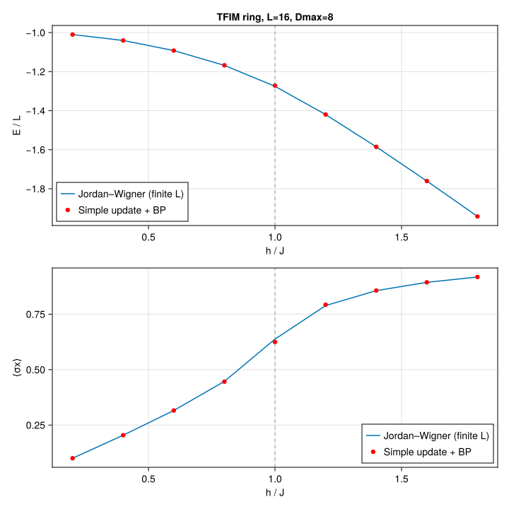

```@meta
EditURL = "../../../../examples/tfim_chain_ring/main.jl"
```


# Transverse-field Ising model on a ring

Imaginary-time evolution of the 1D transverse-field Ising model,

```math
H = -J \sum_{\langle ij \rangle} \sigma^z_i \sigma^z_j - h \sum_i \sigma^x_i,
```

on a ring (cycle graph, PBC), via simple update on top of belief-propagation messages. We
sweep $h$, compute the ground-state energy per site $E/L$ and the transverse magnetization
$\langle \sigma^x \rangle$, and compare against the exact Jordan–Wigner solution at the same
finite $L$.

This example can be run from the command line with:

```
julia --project=examples examples/tfim_chain_ring/main.jl
```

````julia
using Canopy: TensorNetworkState, BPMessages, belief_propagation,
              UndirectedEdge, LocalGate, apply!, reduced_density_matrix, expect,
              Strang, trotterize, edge_coloring
using TensorKit
using TensorKitTensors.SpinOperators: σˣ, σᶻ
using MatrixAlgebraKit: truncrank, trunctol
using Dictionaries
using Graphs: cycle_graph, edges, src, dst, nv
using Random
using Statistics: mean
using Printf
using CairoMakie
````

## Jordan–Wigner reference

In the finite-$L$, even-parity (ground-state) sector of the TFIM ring at $J = 1$, the
antiperiodic momenta are $k_n = (2n-1)\pi/L$ with single-particle dispersion
$\varepsilon(k) = 2\sqrt{J^2 + h^2 - 2 J h \cos k}$ and ground-state energy
$E_0 = -\tfrac{1}{2} \sum_k \varepsilon(k)$.

````julia
_ε(J, h, k) = sqrt(J^2 + h^2 - 2J*h*cos(k))

function jw_energy_per_site(L::Int, h::Real; J::Real=1.0)
    return -(1/L) * sum(_ε(J, h, (2n-1)*π/L) for n in 1:L)
end

function jw_mx_per_site(L::Int, h::Real; J::Real=1.0)
    return (1/L) * sum((h - J*cos((2n-1)*π/L)) / _ε(J, h, (2n-1)*π/L) for n in 1:L)
end
````

````
jw_mx_per_site (generic function with 1 method)
````

## Random ring state

````julia
function ring_state(L::Int, Dmax::Int; T::Type=ComplexF64, S::Type=ComplexSpace)
    g = cycle_graph(L)
    @assert nv(g) == L
    pspaces = Dictionary{Int, S}(1:L, [ComplexSpace(2) for _ in 1:L])
    ekeys = [UndirectedEdge(src(e), dst(e)) for e in edges(g)]
    vspaces = Dictionary{UndirectedEdge{Int}, S}(ekeys, [ComplexSpace(Dmax) for _ in ekeys])
    st = TensorNetworkState{T}(undef, pspaces, vspaces)
    Random.randn!(st)
    return st, ekeys
end
````

````
ring_state (generic function with 1 method)
````

## TFIM bond operators

We distribute the bond Hamiltonian across edges as

```math
h_e = -J\, \sigma^z \otimes \sigma^z - \frac{h}{\deg(u)}\, \sigma^x \otimes I - \frac{h}{\deg(v)}\, I \otimes \sigma^x,
```

so that $\sum_e h_e = H$ exactly. For a ring every vertex has degree 2.

````julia
function tfim_bond_hamiltonian(J::Real, h::Real, deg_u::Int, deg_v::Int; T::Type=ComplexF64)
    sx, sz = σˣ(T), σᶻ(T)
    iI = id(ComplexSpace(2))
    return -J*(sz ⊗ sz) - (h/deg_u)*(sx ⊗ iI) - (h/deg_v)*(iI ⊗ sx)
end
````

````
tfim_bond_hamiltonian (generic function with 1 method)
````

## Running a single (L, h, Dmax) point

Each point is evolved with a Strang-split Trotter circuit over a decreasing-`dτ` schedule,
re-converging the BP messages after every sweep.

````julia
const SCHEDULE = ((0.1, 60), (0.01, 60), (0.001, 40))

function run_one(L::Int, h::Real, Dmax::Int; J::Real=1.0, seed::UInt=hash((L, h, Dmax)))
    Random.seed!(seed)
    T = ComplexF64
    state, ekeys = ring_state(L, Dmax; T)
    msgs = BPMessages(state)
    msgs = belief_propagation(msgs, state; maxiter=300)

    h_e = tfim_bond_hamiltonian(J, h, 2, 2; T)
    bond_hams = Dict(e => h_e for e in ekeys)
    alg = Strang(edge_coloring(keys(bond_hams)))
    circuits = Dict(dτ => trotterize(bond_hams, dτ, alg) for (dτ, _) in SCHEDULE)
    trunc = truncrank(Dmax) & trunctol(; atol=0.0)

    for (dτ, nsteps) in SCHEDULE
        circuit = circuits[dτ]
        for _ in 1:nsteps
            apply!(state, msgs, circuit; trunc)
            msgs = belief_propagation(msgs, state; maxiter=200)
        end
    end

    E = sum(real(expect(state, msgs, h_e, e)) for e in ekeys)
    mx = mean(real(expect(state, msgs, σˣ(T), v)) for v in 1:L)
    return E / L, mx
end
````

````
run_one (generic function with 1 method)
````

## Scan and plot

Sweep $h$, run the simple-update point at each value, and overlay the result on the exact
Jordan–Wigner curves for the energy per site and the transverse magnetization. The dashed
line marks the $h/J = 1$ critical point.

````julia
function main(; L::Int=16, Dmax::Int=8, hs=range(0.2, 1.8; length=9), J::Real=1.0)
    E_su = similar(hs, Float64); mx_su = similar(hs, Float64)
    E_jw = similar(hs, Float64); mx_jw = similar(hs, Float64)

    println("TFIM ring  L=$L  Dmax=$Dmax  J=$J")
    @printf "  %-6s  %-12s  %-12s  %-12s  %-12s\n" "h" "E/L (SU)" "E/L (JW)" "mx (SU)" "mx (JW)"
    for (i, h) in enumerate(hs)
        E_jw[i]  = jw_energy_per_site(L, h; J)
        mx_jw[i] = jw_mx_per_site(L, h; J)
        E_su[i], mx_su[i] = run_one(L, h, Dmax; J)
        @printf "  %-6.3f  %-12.8f  %-12.8f  %-12.8f  %-12.8f\n" h E_su[i] E_jw[i] mx_su[i] mx_jw[i]
        flush(stdout)
    end

    fig = Figure(size=(720, 720))
    ax1 = Axis(fig[1, 1]; xlabel="h / J", ylabel="E / L",
               title="TFIM ring, L=$L, Dmax=$Dmax")
    lines!(ax1, collect(hs), E_jw; label="Jordan–Wigner (finite L)")
    scatter!(ax1, collect(hs), E_su; label="Simple update + BP", color=:red)
    vlines!(ax1, [1.0]; color=(:gray, 0.5), linestyle=:dash)
    axislegend(ax1; position=:lb)

    ax2 = Axis(fig[2, 1]; xlabel="h / J", ylabel="⟨σx⟩")
    lines!(ax2, collect(hs), mx_jw; label="Jordan–Wigner (finite L)")
    scatter!(ax2, collect(hs), mx_su; label="Simple update + BP", color=:red)
    vlines!(ax2, [1.0]; color=(:gray, 0.5), linestyle=:dash)
    axislegend(ax2; position=:rb)

    outdir = joinpath(@__DIR__, "figs"); mkpath(outdir)
    outfile = joinpath(outdir, "tfim_chain_ring.svg")
    save(outfile, fig)
    println("wrote $outfile")
    return fig
end

main()
````

````
TFIM ring  L=16  Dmax=8  J=1.0
  h       E/L (SU)      E/L (JW)      mx (SU)       mx (JW)     
  0.200   -1.01002525   -1.01002525   0.10050837    0.10050766  
  0.400   -1.04041709   -1.04041709   0.20426912    0.20426234  
  0.600   -1.09223858   -1.09224067   0.31579700    0.31581838  
  0.800   -1.16769143   -1.16797178   0.44507308    0.44700377  
  1.000   -1.27139693   -1.27528715   0.62495298    0.63764358  
  1.200   -1.41960621   -1.41996730   0.79272293    0.78880788  
  1.400   -1.58518712   -1.58523066   0.85663358    0.85613812  
  1.600   -1.76050808   -1.76051440   0.89372602    0.89363731  
  1.800   -1.94180429   -1.94180544   0.91769495    0.91766980  
wrote /mnt/home/ldevos/Projects/Canopy/main/docs/src/examples/tfim_chain_ring/figs/tfim_chain_ring.svg

````



---

*This page was generated using [Literate.jl](https://github.com/fredrikekre/Literate.jl).*

